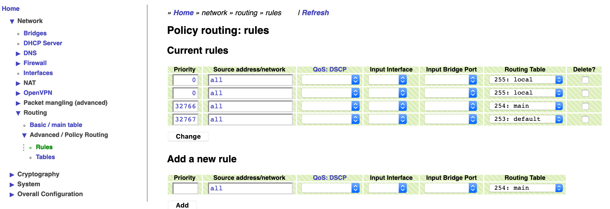

<!-- START doctoc generated TOC please keep comment here to allow auto update -->
<!-- DON'T EDIT THIS SECTION, INSTEAD RE-RUN doctoc TO UPDATE -->
**Table of Contents** (<sup>[&loz;](#ndtoc)</sup>)

- [**Margay's IP Routes API v1**](#margays-ip-routes-api-v1)
- [*Preliminary info*](#preliminary-info)
  - [Base URLs](#base-urls)
  - [Authentication](#authentication)
- [*IP routes*](#ip-routes)
  - [List Routes (`main` routing table) (GET)](#list-routes-main-routing-table-get)
    - [Example response body](#example-response-body)
  - [Add a Route to the `main` table (POST)](#add-a-route-to-the-main-table-post)
    - [Example request body](#example-request-body)
    - [Errors](#errors)
  - [Delete a Route from the `main` table (PUT)](#delete-a-route-from-the-main-table-put)
    - [Example Request body](#example-request-body)
- [*Routing tables other than `main` (Policy Routing)*](#routing-tables-other-than-main-policy-routing)
- [*Notes*](#notes)

<!-- END doctoc generated TOC please keep comment here to allow auto update -->

# **Margay's IP Routes API v1**

A ReSTful API to manage [IP routes](https://wiki.linuxfoundation.org/networking/iproute2) in a Margay system.

# *Preliminary info*

## Base URLs

* http://localhost:4567/api/v1/routing/&lt;tables|rules&gt;
* https://localhost/api/v1/network/routing/&lt;tables|rules&gt;

## Authentication

Unless otherwise noted, use [Basic HTTP Authentication](https://en.wikipedia.org/wiki/Basic_access_authentication)
at each request. The default user is `admin`, password `admin`. Of course, the administrator
is advised to change this in production.

For example, with [cURL](https://curl.haxx.se/), use `curl -u <username>:<password> <URL>`
&mdash; or `curl -u <username> <URL>` and enter the password when prompted.


# *IP routes*

## List Routes (`main` routing table) (GET)

```http
GET http://localhost:4567/api/v1/network/routing/tables/main HTTP/1.1

Accept: application/json
```

Returns the list of all the IP routes in the `main` table.

### Example response body

```javascript
{
  "number": 254,
  "name": "main",
  "system": [
    254,
    "main"
  ],
  "routes": [
    {
      "rttype": "unicast",
      "dest": {
        "addr": "0.0.0.0",
        "prefixlen": 0,
        "af": "inet"
      },
      "gw": "192.168.177.1",
      "dev": "eth0",
      "proto": null,
      "metric": 1203,
      "mtu": null,
      "advmss": null,
      "error": null,
      "hoplimit": null,
      "scope": null,
      "src": "192.168.177.4",
      "rawline": "default via 192.168.177.1 dev eth0 src 192.168.177.4 metric 1203"
    },
    {
      "rttype": "unicast",
      "dest": {
        "addr": "2.2.2.2",
        "prefixlen": 32,
        "af": "inet"
      },
      "gw": null,
      "dev": "eth1",
      "proto": "static",
      "metric": 204,
      "mtu": null,
      "advmss": null,
      "error": null,
      "hoplimit": null,
      "scope": "link",
      "src": null,
      "rawline": "2.2.2.2 dev eth1  scope link metric 204"
    },
    {
      "rttype": "unicast",
      "dest": {
        "addr": "127.0.0.0",
        "prefixlen": 8,
        "af": "inet"
      },
      "gw": null,
      "dev": "lo",
      "proto": "kernel",
      "metric": 201,
      "mtu": null,
      "advmss": null,
      "error": null,
      "hoplimit": null,
      "scope": "host",
      "src": "127.0.0.1",
      "rawline": "127.0.0.0/8 dev lo  scope host src 127.0.0.1 metric 201"
    },
    {
      "rttype": "unicast",
      "dest": {
        "addr": "192.168.177.0",
        "prefixlen": 24,
        "af": "inet"
      },
      "gw": null,
      "dev": "eth0",
      "proto": "kernel",
      "metric": 1203,
      "mtu": null,
      "advmss": null,
      "error": null,
      "hoplimit": null,
      "scope": "link",
      "src": "192.168.177.4",
      "rawline": "192.168.177.0/24 dev eth0  scope link src 192.168.177.4 metric 1203"
    },
    {
      "rttype": "unicast",
      "dest": {
        "addr": "::1",
        "prefixlen": 128,
        "af": "inet6"
      },
      "gw": null,
      "dev": "lo",
      "proto": "kernel",
      "metric": 256,
      "mtu": null,
      "advmss": null,
      "error": null,
      "hoplimit": null,
      "scope": null,
      "src": null,
      "rawline": "::1 dev lo  metric 256 pref medium"
    },
    {
      "rttype": "unicast",
      "dest": {
        "addr": "fe80::",
        "prefixlen": 64,
        "af": "inet6"
      },
      "gw": null,
      "dev": "lo",
      "proto": "kernel",
      "metric": 256,
      "mtu": null,
      "advmss": null,
      "error": null,
      "hoplimit": null,
      "scope": null,
      "src": null,
      "rawline": "fe80::/64 dev lo  metric 256 pref medium"
    },
    {
      "rttype": "unicast",
      "dest": {
        "addr": "fe80::",
        "prefixlen": 64,
        "af": "inet6"
      },
      "gw": null,
      "dev": "eth1",
      "proto": "kernel",
      "metric": 256,
      "mtu": null,
      "advmss": null,
      "error": null,
      "hoplimit": null,
      "scope": null,
      "src": null,
      "rawline": "fe80::/64 dev eth1  metric 256 pref medium"
    },
    {
      "rttype": "unicast",
      "dest": {
        "addr": "fe80::",
        "prefixlen": 64,
        "af": "inet6"
      },
      "gw": null,
      "dev": "eth0",
      "proto": "kernel",
      "metric": 256,
      "mtu": null,
      "advmss": null,
      "error": null,
      "hoplimit": null,
      "scope": null,
      "src": null,
      "rawline": "fe80::/64 dev eth0  metric 256 pref medium"
    }
  ]
}
```

## Add a Route to the `main` table (POST)

```http
POST http://localhost:4567/api/v1/network/routing/tables/main HTTP/1.1

Accept: application/json
```

### Example request body

```javascript
{
  "ip": "2.2.2.0",
  "prefixlen": "24",
  "dev": "eth1",
  "gw": "1.1.1.2",
  "metric": "1"
}
```

For a *default* gateway, use `"0.0.0.0"` or `"::"` as `"ip"` (respectively IPv4 and IPv6)
and `"0"` or `0` as `"prefixlen"`.

`"dev"` and `"gw"` cannot be both empty or `null` or absent.

`"metric"` is optional.
If absent, defaults from [Network Interfaces](network-interfaces.md) will be used.

### Errors

`4xx` status codes will be returned in response of invalid data.

For example, if the gateway address (`"gw"`) is invalid for the interface,
`400` will be returned as status code, with body e.g.:

```javascript
{
  "ok": false,
  "cmd": "ip route add 2.2.2.0/24 via 99.1.1.2 dev eth1 metric 1 proto static table 254",
  "status": 2,
  "stdout": "",
  "stderr": "Error: Nexthop has invalid gateway.\n"
}
```


## Delete a Route from the `main` table (PUT)

```http
PUT http://localhost:4567/api/v1/network/routing/tables/main HTTP/1.1

Content-Type: application/json
Accept: application/json
```

Using the PUT method for *deleting* a route may seem un-ReSTful,
however, the URL refers to the routing table, not a single route.
Also, engineering identifying URLs for each route may be
open to ambiguities and not straightforward.

### Example Request body

```javascript
{
 "ip_route_del": "2.2.2.2 dev eth1  scope link metric 204",
 "af": "inet"
}
```

The value of the `"ip_route_del"` identifies the IP route to be deleted. The string is taken
from the `"rawline"` property from the `GET` endpoint.

`"af"` is the <em>**a**ddress **f**amily</em> and can be `"inet"` for IPv4 or `"inet6"` for IPv6.
It MUST me specified, particulary to avoid ambiguity when the destination is `default`.

# *Routing tables other than `main` (Policy Routing)*

This is an
[advanced](https://lartc.org/)
[topic](https://lartc.org/howto/lartc.rpdb.html).

At the moment, we don't have a urgent use case for *programmatic access* to this feature.
API documentation (and appropriate, related QA) may be added at some point
in future, though.
Meanwhile, the functionality is fully available to Network Administrators
via **web UI**.

  &nbsp;<!--
-->

# *Notes*

(<sup>&loz;</sup>) <a name="ndtoc"></a> Table of Contents generated with [DocToc](https://github.com/thlorenz/doctoc).
